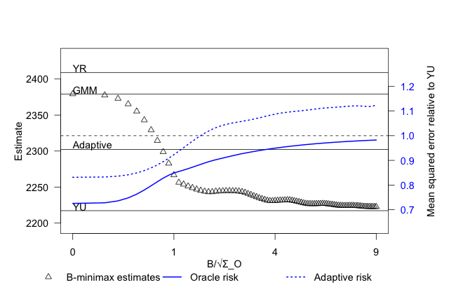

# MissAdapt

## Introduction
This repository contains the code and documentation to replicate the example usage in Section 3 of "Adapting to Misspecification" by [Armstrong, Kline, and Sun (2023)](https://arxiv.org/pdf/2305.14265.pdf). In addition to the paper, the example included here is also explained in the beginning of the presentation at the Chamberlain online seminar, recorded [here](https://youtu.be/JrDsCW-1h6A).  

You can find the MATLAB and R code implementing the adaptive estimator, its soft-thresholding approximation, and their risk limited variants proposed in the paper. Matlab code is provided in the folder `/Matlab/`. R code is provided in the folder `/R/`. 

## A vignette for example usage
Here we provide an example usage of the adaptive estimator to results from the paper:  

Dobkin, Carlos, Amy Finkelstein, Raymond Kluender, and Matthew J. Notowidigdo. 2018. "The Economic Consequences of Hospital Admissions." American Economic Review, 108 (2): 308-52.

In this example, the parameter of interest is the contemporaneous impact of hospitalization on out-of-pocket medical spending (in dollars per year). Two linear event study specifications are considered: an *unrestricted* specification that allows for a linear trend and a *restricted* specification that omits this trend. Both specifications are estimated by ordinary least squares. Interpreting these estimates is difficult because we can't be sure whether a trend is actually present or not.  If a linear trend is present, the restricted estimator will be biased, while the unrestricted estimator will remain unbiased. However, if no trend is present, the restricted estimator will be more precise. 

The adaptive estimator pools information across the unrestricted and restricted estimators to arrive at a single estimate that yields a nearly optimal balance between precision and worst case bias. By "nearly optimal" we mean that the adaptive estimator achieves a worst case mean squared error (MSE) as close as possible to that of an *oracle* that knows the magnitude (but not the sign) of the bias faced by the restricted estimator. We call the excess worst case MSE of the adaptive estimator over the oracle the *adaptation regret*. A small adaptation regret indicates a nearly optimal balance is being struck between precision and robustness to potential biases. As discussed in the paper -- and illustrated below -- the adaptive estimator will always exhibit lower adaptation regret than selecting a model based upon a pre-test, with especially large differences resulting when such tests exhibit low power.

While the vignette below is illustrated in `R`, this example can be implemented using either the `example.m` or `example.R` script.  Please note that the script assumes that the `MATLAB/lookup_tables/` directory, which contains the pre-tabulated adaptive estimators, is correctly downloaded and referenced in the provided paths.
	
### 1. Load data
We first load the typical data reported in robustness checks: the unrestricted `YU` and restricted `YR` estimates of the impact of hospitalization on out-of-pocket medical spending. We also load their variance-covariance matrix `VR, VU, VUR`. Note that the covariance `VUR` between the two estimators is similar to the restricted estimator's variance `VR`, suggesting that, in the absence of bias, the restricted estimator `YR` would be nearly efficient. 
```r
YR <- 2409; VR <- 221^2; # the restricted estimator and its squared standard error
YU <- 2217; VU <- 257^2; # the unrestricted estimator and its squared standard error
VUR <- 211^2; # the covariance between the restricted and robust estimators
```
### 2. Gather the inputs needed for adapting to misspecification: over-ID test statistic and the correlation coefficient
We calculate the over-identification (over-ID) test statistic to be `tO=1.2`:
```r
YO <- YR - YU; VO <- VR - 2*VUR + VU;
tO <- YO / sqrt(VO);
```
We compute the correlation coefficient to be `corr=-0.52`:
```r
VUO <- (VUR - VU); corr <- VUO/sqrt(VO)/sqrt(VU);
```

### 3. Calculate the adaptive estimate based on interpolation
Based on the correlation coefficient, we interpolate the adaptive estimator based on pre-tabulated results in the `/lookup_tables/` directory. To do so, we just need to feed our estimates to the wrapper function `calculate_adaptive_estimates()`, which returns the adaptive estimate given the over-id test statistic. The over-id test statistic and the correlation coefficient are computed in `calculate_adaptive_estimates()`.  As explained above, they can be computed easily given `(YR, VR, YU, VU, VUR)`. This function also approximates the adaptive estimator based on soft-thresholding, which can be thought of as analogous to LASSO shrinkage of `YU` towards the efficient estimate in the absence of bias. The other wrapper function `calculate_max_regret()` returns the adaptation regret of the estimators, which we abbreviate as "max regret."   

```r
adaptive_estimate_results <- calculate_adaptive_estimates(YR, VR, YU, VU, VUR)
max_regret_results <- calculate_max_regret(VR, VU, VUR)
```
The results returned by these two functions are summarized in the table below. In this case, the pre-test estimator, which chooses between the restricted estimator $Y_{R}$ and the robust estimator $Y_{U}$ based on the over-identification statistic, exhibits a large max regret of 68%. Intuitively, while the pre-test may perform well if the bias is very large -- in which case $Y_{U}$ will be selected -- or very small -- in which case $Y_{R}$ will be selected -- there exist intermediate values of bias at which the pre-test estimator becomes very noisy because it has low power.

In contrast, the adaptive estimator provides exhibits a max regret of only 15%, indicating near oracle performance. That is, the adaptive estimator exposes the researcher to worst case MSE only 15% greater than what they would face if the magnitude of any confounding trend were known ex-ante.

<div align="center">
  <table>
    <tr>
      <th>Hospitalization Year=0</th>
      <th>$Y_{U}$</th>
      <th>$Y_{R}$</th>
      <th>$Y_O$</th>
      <th>GMM</th>
      <th>Adaptive</th>
      <th>Soft-threshold</th>
      <th>Pre-test</th>
    </tr>
    <tr>
      <td>Estimate</td>
      <td>2,217</td>
      <td>2,409</td>
      <td>192</td>
      <td>2,379</td>
      <td>2,302</td>
      <td>2,287</td>
      <td>2,409</td>
    </tr>
    <tr>
      <td>Std Error</td>
      <td>(257)</td>
      <td>(221)</td>
      <td>(160)</td>
      <td>(219)</td>
      <td></td>
      <td></td>
      <td></td>
    </tr>
    <tr>
      <td>Max Regret</td>
      <td>38%</td>
      <td>∞</td>
      <td></td>
      <td>∞</td>
      <td>15%</td>
      <td>15%</td>
      <td>68%</td>
    </tr>
    <tr>
      <td>Threshold</td>
      <td></td>
      <td></td>
      <td></td>
      <td></td>
      <td></td>
      <td>0.52</td>
      <td>1.96</td>
    </tr>
  </table>
</div>


The GMM estimate is efficient when `YR` is unbiased (i.e., when no trend is present).  It is calculated as:
```r
GMM <- YU - VUO /VO * YO;
```
### 4. Plot the locus of minimax estimates 
The oracle performance mentioned in the previous section can be visualized in terms of a locus of $B$*-minimax* estimates, each of which minimizes the worst case risk under subject to an upper bound $B$ on the magnitude of the bias. Lower values of $B$ allow greater gains in precision because bias is less of a concern. For example, the $0$-minimax estimator is GMM, which exhibits the lowest variance, while the $\infty$-minimax estimator is $Y_U$, which exhibits the highest variance but is maximally robust. If one is willing to stipulate a finite bound $B$ in an application, the $B$-minimax estimator may be preferable to the adaptive estimator.

The wrapper function `plot_adaptive_and_minimax_estimates()` returns the $B$-minimax estimates, along with their worst case risk, and the worst case risk of the adaptive estimator that doesn't require specifying the bound $B$. 
```r
plot_adaptive_and_minimax_estimates(YR, YU, VR, VU, VUR)  
```
<p align="center">
  
</p>

From this plot, we see that as $B$ increases, the $B$-minimax estimator asymptotes towards $Y_U$. The worst case risk is shown on the second y-axis where, for convenience, the MSE of $Y_U$ has been normalized to one. In this case, if the bias were known to the be zero, the GMM estimator would yield worst case risk nearly 30\% below $Y_U$. The adaptive estimator's worst case risk exceeds the oracle's worst case risk at all bias magnitudes, which is the price the researcher must pay for not knowing the bound $B$ ahead of time. However, the adaptive estimator's worst case risk comes as close to the oracle's worst case risk across all bias magnitudes as possible. See Section 3 of [Armstrong, Kline, Sun (2023)](https://arxiv.org/pdf/2305.14265.pdf) for further discussion.


## `/Matlab/` contains

`/lookup_tables/` contains pre-tabulated solutions to the adaptation problem over a grid of correlation coefficients.

`adaptive_estimate.m` : a function that takes the input of the pre-tabulated solutions and outputs the adaptive estimates via a lookup table as well as the max regret.

`const_estimate.m` : a function that takes the input of the pre-tabulated solutions and outputs the adaptive estimates via a lookup table where the worst-case MSE is constrained to be no more than {5%,15%,20%} of $Y_U$.  The default is set to 20%.

`minimax_locus_plot.m` : a function that takes the input of the pre-tabulated solutions and outputs the locus of $B$-minimax estimates via a lookup table.  The oracle MSE function (risk of each $B$-minimax estimator) as well as the risk function of the adaptive estimator are also plotted.

`example.m` : an example script that calls `adaptive_estimate.m` and `const_estimate.m` and outputs the adaptive results in a formatted csv file; it also calls `minimax_locus_plot.m` and outputs the $B$-minimax locus plot along with risk functions.

## `/R/` contains

`example.R` : an example script that reads the pre-tabulated solutions and outputs the adaptive estimates via an instantaneous lookup table.

`calculate_adaptive_estimates.R` : a function that takes the input of the pre-tabulated solutions and outputs the adaptive estimates as well as the constrained version via a lookup table.

`calculate_max_regret.R` : a function that takes the input of the pre-tabulated solutions and outputs the max regret of various estimators.

`plot_adaptive_and_minimax_estimates.R` : a function that takes the input of the pre-tabulated solutions and outputs the locus of $B$-minimax estimates via a lookup table.  The oracle MSE function (risk of each $B$-minimax estimator) as well as the risk function of the adaptive estimator are also plotted.
