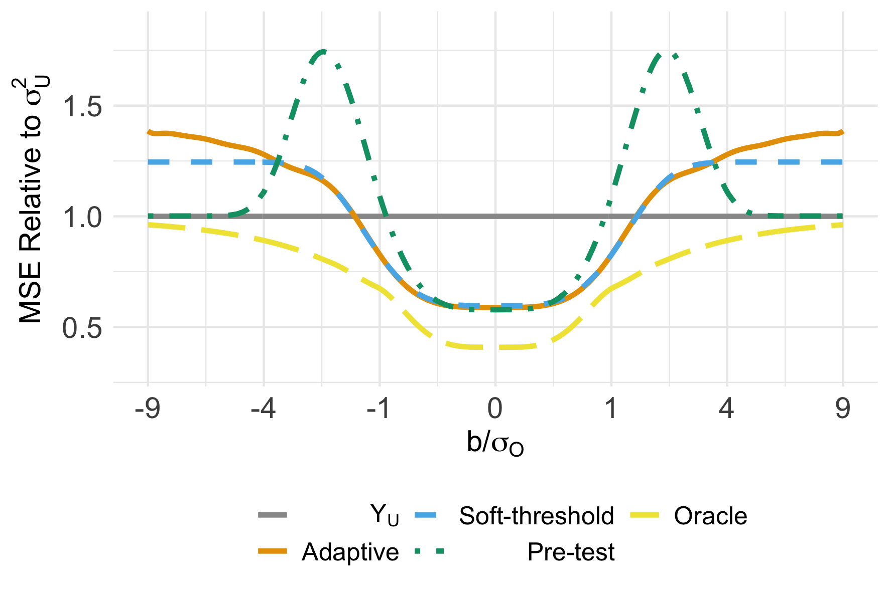

# MissAdapt

## Introduction
This repository provides code that replicates key figures and results in the introductory example from [Armstrong, Kline, and Sun (2023)](https://arxiv.org/pdf/2305.14265.pdf).  

You can find the R functions implementing the adaptive estimator, its soft-thresholding approximation, and their confidence intervals proposed in the paper. R code is provided in the folder `/R/`. Lagacy Matlab code is provided in the folder `/Matlab/`. 

## A vignette for example usage
Here we provide an example usage of the adaptive estimator to results from the paper:  

de Chaisemartin, C. and X. D’Haultfœuille (2020). Two-Way Fixed Effects Estimators with Heterogeneous Treatment Effects. American Economic Review 110 (9), 2964–2996

In this example, the parameter of interest is the average effect of an additional newspaper in counties gaining or losing a newspaper, estimated using data from Gentzkow et al (2011). Two linear event study specifications are considered: an *unrestricted* specification that allows for heterogenous effects and a *restricted* specification that imposes homogeneity. If effects are indeed heterogenous over time and across counties, the restricted estimator will be biased, while the unrestricted estimator will remain unbiased. However, if no heterogeneity is present, the restricted estimator will be more precise. 

The adaptive estimator pools information across the unrestricted and restricted estimators to arrive at a single estimate that yields a nearly optimal balance between precision and worst case bias. By "nearly optimal" we mean that the adaptive estimator achieves a worst case mean squared error (MSE) as close as possible to that of an *oracle* that knows the magnitude (but not the sign) of the bias faced by the restricted estimator. We call the excess worst case MSE of the adaptive estimator over the oracle the *adaptation regret*. A small adaptation regret indicates a nearly optimal balance is being struck between precision and robustness to potential biases. As discussed in the paper -- and illustrated below -- the adaptive estimator will always exhibit lower adaptation regret than selecting a model based upon a pre-test, with especially large differences resulting when such tests exhibit low power.

The vignette below is illustrated in `R` using the `example.R` script.  Please note that the script assumes that the `MATLAB/lookup_tables/` directory, which contains the pre-tabulated adaptive estimators, is correctly downloaded and referenced in the provided paths.
	
### 1. Load data
We first load the typical data reported in robustness checks: the unrestricted `YU` and restricted `YR` estimates (replicated from Table 3 of de Chaisemartin and D’Haultfœuille, 2020). We also load their variance-covariance matrix `VR, VU, VUR`. In this illustration, we assume that in the absence of bias, the restricted estimator `YR` is efficient.  Therefore the covariance `VUR` between the two estimators is equal to the restricted estimator's variance `VR`.  In the general case, we can compute their covariance using replication data.
```r
YR <- 0.0026; VR <- 0.0009^2; # the restricted estimator and its squared standard error
YU <- 0.0043; VU <- 0.0014^2; # the unrestricted estimator and its squared standard error
VUR <- VR; # the covariance between the restricted and robust estimators
```
### 2. Gather the inputs needed for adapting to misspecification: over-ID test statistic and the correlation coefficient
We calculate the over-identification (over-ID) test statistic to be `tO=-1.59`:
```r
YO <- YR - YU; VO <- VR - 2*VUR + VU;
tO <- YO / sqrt(VO);
```
We compute the correlation coefficient to be `corr=-0.77`:
```r
VUO <- (VUR - VU); corr <- VUO/sqrt(VO)/sqrt(VU);
```

### 3. Calculate the adaptive estimate based on interpolation
Based on the correlation coefficient, we interpolate the adaptive estimator based on pre-tabulated results in the `/lookup_tables/` directory. To do so, we just need to feed our estimates to the wrapper function `calculate_adaptive_estimates()`, which returns the adaptive estimate given the over-id test statistic. The over-id test statistic and the correlation coefficient are computed in `calculate_adaptive_estimates()`.  As explained above, they can be computed easily given `(YR, VR, YU, VU, VUR)`. This function also approximates the adaptive estimator based on soft-thresholding, which can be thought of as analogous to LASSO shrinkage of `YU` towards the efficient estimate in the absence of bias. The other wrapper function `calculate_max_regret()` returns the adaptation regret of the estimators, which we abbreviate as "max regret."   

```r
adaptive_estimate_results <- calculate_adaptive_estimates(YR, VR, YU, VU, VUR)
max_regret_results <- calculate_max_regret(VR, VU, VUR)
```
The results returned by these two functions are summarized in the table below. In this case, the pre-test estimator, which chooses between the restricted estimator $Y_{R}$ and the robust estimator $Y_{U}$ based on the over-identification statistic, exhibits a large max regret of 118%. Intuitively, while the pre-test may perform well if the bias is very large -- in which case $Y_{U}$ will be selected -- or very small -- in which case $Y_{R}$ will be selected -- there exist intermediate values of bias at which the pre-test estimator becomes very noisy because it has low power.

In contrast, the adaptive estimator provides exhibits a max regret of only 44%, indicating near oracle performance. That is, the adaptive estimator exposes the researcher to worst case MSE only 44% greater than what they would face if the magnitude of any confounding trend were known ex-ante.

<div align="center">
  <table>
    <tr>
      <th></th>
      <th>$Y_{U}$</th>
      <th>$Y_{R}$</th>
      <th>Adaptive</th>
      <th>Soft-threshold</th>
      <th>Pre-test</th>
    </tr>
    <tr>
      <td>Estimate</td>
      <td>0.43</td>
      <td>0.26</td>
      <td>0.36</td>
      <td>0.36</td>
      <td>0.26</td>
    </tr>
    <tr>
      <td>Std Error</td>
      <td>(0.14)</td>
      <td>(0.09)</td>
      <td></td>
      <td></td>
      <td></td>
    </tr>
    <tr>
      <td>Max Regret</td>
      <td>145%</td>
      <td>∞</td>
      <td>44%</td>
      <td>46%</td>
      <td>145%</td>
    </tr>
    <tr>
      <td>Threshold</td>
      <td></td>
      <td></td>
      <td></td>
      <td>0.64</td>
      <td>1.96</td>
    </tr>
  </table>
</div>

 
### 4. Plot the risk function
The adaptive performance mentioned in the previous section can be visualized in terms of the distance of different estimators relative oracle.  The wrapper function `plot_adaptive_and_minimax_risk()` returns the risk as a function of scaled bias $b/\sigma_O.$
```r
plot_adaptive_and_minimax_risk(YR, YU, VR, VU, VUR)  
```
<p align="center">
  
</p>

For convenience, the MSE of $Y_U$ has been normalized to one. In this case, if the bias were known to the be zero, the $Y_R$ estimator would yield worst case risk nearly 60\% below $Y_U$. The adaptive estimator's worst case risk exceeds the oracle's worst case risk at all bias magnitudes, which is the price the researcher must pay for not knowing the bound $B$ ahead of time. However, the adaptive estimator's worst case risk comes as close to the oracle's worst case risk across all bias magnitudes as possible. See Section 2 of [Armstrong, Kline, Sun (2023)](https://arxiv.org/pdf/2305.14265.pdf) for further discussion.

### 5. Form confidence intervals
From the risk plots, we see $Y_U$ has constant risk, which is how the 95\% CI centered at $Y_U$ guarantees 95\% coverage for all values of $b/\sigma_O.$ In contrast, the adaptive estimator involves bias-variance trade-off at different values of $b/\sigma_O.$  Correspondingly, if we center the same 95\% CI b at the adaptive estimator, we expect to see trade-off in terms of coverage as well.  The exact coverage in the best-case scenario when $b/\sigma_O=0$ versis worst-case scenario when $b/\sigma_O\in(-\infty,\infty)$ is calculated by
```r
calculate_coverage(YR, VR, YU, VU, VUR,B=9)
```
 
<div align="center">
  <table>
    <tr>
      <th></th>
      <th>$Y_{U}$</th>
      <th>$Y_{R}$</th>
      <th>Adaptive</th>
      <th>Soft-threshold</th>
      <th>Pre-test</th>
    </tr>
    <tr>
      <td></td>
      <td> $\pm 1.96\sigma_U$ </td>
      <td> $\pm 1.96\sigma_R$ </td>
      <td> $\pm 1.96\sigma_U$ </td>
      <td> $\pm 1.96\sigma_U$ </td>
      <td></td>
    </tr>
    <tr>
      <td>Max Coverage</td>
      <td>95%</td>
      <td>95%</td>
      <td>98%</td>
      <td>98%</td>
      <td>95%</td>
    </tr>
    <tr>
      <td>Min Coverage</td>
      <td>95%</td>
      <td>0%</td>
      <td>90%</td>
      <td>93%</td>
      <td>67%</td>
    </tr>
  </table>
</div>

The trade-off is even more stark if we limit the space for which the CI needs to have 95\% coverage for. For example, the critical values $c_{.05}(1)$ that guarantee the adaptive and soft-threshold estimators to have 95\% coverage when $b/\sigma_O\in(-1,1)$ are 1.74 and 1.77.  The resulting CIs are tighter, and the same function can be used to evaluate the coverage trade-offs.
```r
calculate_coverage(YR, VR, YU, VU, VUR,B=1)
```
<div align="center">
  <table>
    <tr>
      <th></th>
      <th>$Y_{U}$</th>
      <th>$Y_{R}$</th>
      <th>Adaptive</th>
      <th>Soft-threshold</th>
      <th>Pre-test</th>
    </tr>
    <tr>
      <td></td>
      <td> $\pm 1.96\sigma_U$ </td>
      <td> $\pm 1.96\sigma_R$ </td>
      <td> $\pm c_{.05}(1) \sigma_U$ </td>
      <td> $\pm c_{.05}(1) \sigma_U$ </td>
      <td></td>
    </tr>
    <tr>
      <td>Max Coverage</td>
      <td>95%</td>
      <td>95%</td>
      <td>97%</td>
      <td>97%</td>
      <td>95%</td>
    </tr>
    <tr>
      <td>Min Coverage</td>
      <td>95%</td>
      <td>0%</td>
      <td>86%</td>
      <td>90%</td>
      <td>67%</td>
    </tr>
  </table>
</div>

 
## `/R/` contains

`example.R` : an example script that reads the pre-tabulated solutions and outputs the adaptive estimates via an instantaneous lookup table.

`calculate_adaptive_estimates.R` : a function that takes the input of the pre-tabulated solutions and outputs the adaptive estimates as well as the constrained version via a lookup table.

`calculate_max_regret.R` : a function that takes the input of the pre-tabulated solutions and outputs the max regret of various estimators.

`plot_adaptive_and_minimax_risk.R` : a function that takes the input of the variance covariance matrix and outputs the oracle MSE function as well as the risk function of the adaptive estimator are also plotted.

`calculate_coverage.R` : a function that takes the input of the variance covariance matrix and outputs the critical values that guarantee the adaptive and soft-threshold estimators to have 95\% coverage when $b/\sigma_O\in(-B,B)$. It also calculates the covareage in the best-case scenario when $b/\sigma_O=0$ versis worst-case scenario when $b/\sigma_O\in(-\infty,\infty)$.
